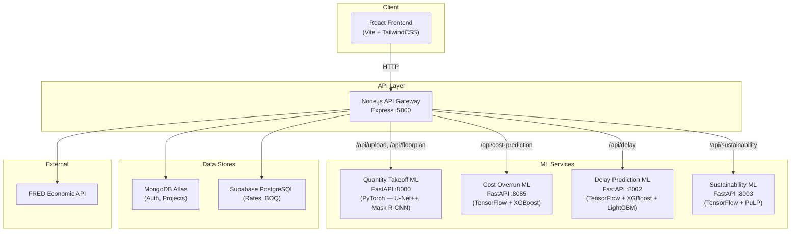
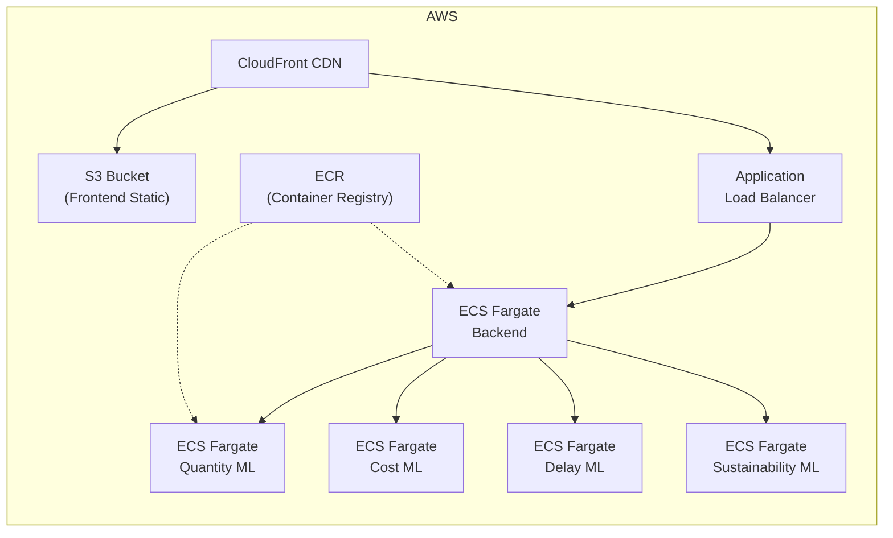

# 🚀 Green Build — Deployment Plan

## 1. Architecture Overview



### Service Port Map

| Service | Tech Stack | Port | Model Size |
|---|---|---|---|
| **Frontend** | React 19 + Vite 7 + TailwindCSS 4 | 5173 (dev) / 80 (prod) | — |
| **API Gateway** | Node.js 18+ / Express 4 | 5000 | — |
| **Quantity Takeoff ML** | FastAPI + PyTorch | 8000 | ~320 MB (3 `.pth` files) |
| **Cost Overrun ML** | FastAPI + TensorFlow + scikit-learn | 8085 | ~15 MB (`.joblib` + `.keras`) |
| **Delay Prediction ML** | FastAPI + TensorFlow + XGBoost + LightGBM | 8002 | ~14 MB (`.h5` + `.joblib`) |
| **Sustainability ML** | FastAPI + TensorFlow + PuLP | 8003 | ~0.5 MB (`.keras` + `.pkl`) |

### Database Connections
- **MongoDB Atlas** — User auth (JWT), projects, floor plans metadata
- **Supabase PostgreSQL** — Material rates, BOQ reports, economic indicators

---

## 2. Dockerization Strategy

### 2.1 Frontend — `frontend/Dockerfile`

```dockerfile
# ── Stage 1: Build ──
FROM node:20-alpine AS builder
WORKDIR /app
COPY package*.json ./
RUN npm ci
COPY . .

# Build-time env vars for API URL
ARG VITE_API_BASE_URL
ENV VITE_API_BASE_URL=${VITE_API_BASE_URL}
ARG VITE_API_URL
ENV VITE_API_URL=${VITE_API_URL}

RUN npm run build

# ── Stage 2: Serve ──
FROM nginx:1.27-alpine
COPY --from=builder /app/dist /usr/share/nginx/html
COPY nginx.conf /etc/nginx/conf.d/default.conf
EXPOSE 80
CMD ["nginx", "-g", "daemon off;"]
```

### `frontend/nginx.conf`

```nginx
server {
    listen 80;
    server_name _;
    root /usr/share/nginx/html;
    index index.html;

    # Gzip compression
    gzip on;
    gzip_types text/plain text/css application/json application/javascript text/xml;

    # SPA fallback
    location / {
        try_files $uri $uri/ /index.html;
    }

    # Cache static assets
    location ~* \.(js|css|png|jpg|jpeg|gif|ico|svg|woff|woff2)$ {
        expires 1y;
        add_header Cache-Control "public, immutable";
    }
}
```

---

### 2.2 Backend API Gateway — `backend/Dockerfile`

```dockerfile
FROM node:20-alpine
WORKDIR /app

COPY package*.json ./
RUN npm ci --omit=dev

COPY . .

# Create uploads directory
RUN mkdir -p uploads

EXPOSE 5000
CMD ["node", "server.js"]
```

---

### 2.3 ML Service Dockerfiles

> [!IMPORTANT]
> The Quantity Takeoff service uses **PyTorch** (~2 GB image), while the other three use **TensorFlow** (~1.5 GB image). They need separate base images.

#### `ml-services/quantity-takeoff-ml/Dockerfile` (PyTorch)

```dockerfile
FROM python:3.11-slim

WORKDIR /app

# System dependencies for OpenCV
RUN apt-get update && apt-get install -y --no-install-recommends \
    libgl1-mesa-glx libglib2.0-0 \
    && rm -rf /var/lib/apt/lists/*

COPY requirements.txt .
RUN pip install --no-cache-dir -r requirements.txt

COPY app/ ./app/
COPY models/ ./models/

EXPOSE 8000
CMD ["uvicorn", "app.main:app", "--host", "0.0.0.0", "--port", "8000", "--workers", "1"]
```

> [!WARNING]
> Quantity Takeoff models are ~320 MB total. These **must** be included in the image or mounted via a volume / downloaded at startup from cloud storage.

#### `ml-services/Cost-overrrun-Prediction-ml/Dockerfile` (TensorFlow)

```dockerfile
FROM python:3.11-slim

WORKDIR /app

COPY requirements.txt .
RUN pip install --no-cache-dir -r requirements.txt

COPY app/ ./app/
COPY models/ ./models/

EXPOSE 8085
CMD ["uvicorn", "app.main:app", "--host", "0.0.0.0", "--port", "8085", "--workers", "1"]
```

#### `ml-services/delay-prediction-ml/Dockerfile` (TensorFlow)

```dockerfile
FROM python:3.11-slim

WORKDIR /app

COPY requirements.txt .
RUN pip install --no-cache-dir -r requirements.txt

COPY app/ ./app/
COPY models/ ./models/

EXPOSE 8002
CMD ["uvicorn", "app.main:app", "--host", "0.0.0.0", "--port", "8002", "--workers", "1"]
```

#### `ml-services/sustainability-ml/Dockerfile` (TensorFlow)

```dockerfile
FROM python:3.11-slim

WORKDIR /app

COPY requirements.txt .
RUN pip install --no-cache-dir -r requirements.txt

COPY app/ ./app/
COPY models/ ./models/

EXPOSE 8003
CMD ["uvicorn", "app.main:app", "--host", "0.0.0.0", "--port", "8003", "--workers", "1"]
```

---

### 2.4 Docker Compose — `docker-compose.yml` (Root)

```yaml
version: "3.9"

services:
  # ─── Frontend ────────────────────────────────────
  frontend:
    build:
      context: ./frontend
      args:
        VITE_API_BASE_URL: http://localhost:5000
        VITE_API_URL: http://localhost:5000
    ports:
      - "80:80"
    depends_on:
      - backend
    restart: unless-stopped

  # ─── API Gateway ─────────────────────────────────
  backend:
    build: ./backend
    ports:
      - "5000:5000"
    env_file: ./backend/.env.production
    depends_on:
      - quantity-takeoff-ml
      - cost-overrun-ml
      - delay-prediction-ml
      - sustainability-ml
    volumes:
      - backend-uploads:/app/uploads
    restart: unless-stopped

  # ─── Quantity Takeoff ML (PyTorch) ───────────────
  quantity-takeoff-ml:
    build: ./ml-services/quantity-takeoff-ml
    ports:
      - "8000:8000"
    deploy:
      resources:
        limits:
          memory: 4G
    restart: unless-stopped

  # ─── Cost Overrun Prediction ML (TensorFlow) ────
  cost-overrun-ml:
    build: ./ml-services/Cost-overrrun-Prediction-ml
    ports:
      - "8085:8085"
    deploy:
      resources:
        limits:
          memory: 2G
    restart: unless-stopped

  # ─── Delay Prediction ML (TensorFlow) ───────────
  delay-prediction-ml:
    build: ./ml-services/delay-prediction-ml
    ports:
      - "8002:8002"
    environment:
      - DEV_MODE=false
    deploy:
      resources:
        limits:
          memory: 2G
    restart: unless-stopped

  # ─── Sustainability ML (TensorFlow) ─────────────
  sustainability-ml:
    build: ./ml-services/sustainability-ml
    ports:
      - "8003:8003"
    deploy:
      resources:
        limits:
          memory: 2G
    restart: unless-stopped

volumes:
  backend-uploads:
```

---

### 2.5 Production Environment File — `backend/.env.production`

```env
# Server
PORT=5000
NODE_ENV=production

# MongoDB Atlas
MONGODB_URI=mongodb+srv://<user>:<password>@cluster0.qtq3agg.mongodb.net/greenbuild?retryWrites=true&w=majority

# ML Service URLs (Docker internal network)
PYTHON_SERVICE_URL=http://quantity-takeoff-ml:8000
COST_ML_SERVICE_URL=http://cost-overrun-ml:8085
DELAY_ML_SERVICE_URL=http://delay-prediction-ml:8002
SUSTAINABILITY_ML_URL=http://sustainability-ml:8003

# Frontend URL (for CORS)
FRONTEND_URL=*

# Upload Directory
UPLOAD_DIR=./uploads

# JWT
JWT_SECRET=<GENERATE_A_STRONG_SECRET>
JWT_EXPIRES_IN=7d

# Supabase
SUPABASE_URL=https://atwnhhrdvrduqpbcvbxe.supabase.co
SUPABASE_KEY=<YOUR_SUPABASE_KEY>

# FRED API
FRED_BASE_URL=https://api.stlouisfed.org/fred
FRED_API_KEY=<YOUR_FRED_KEY>
FRED_SERIES_INFLATION=FPCPITOTLZGLKA
FRED_SERIES_EXCHANGE_LKR=EXSLUS
FRED_SERIES_MATERIAL_INDEX=DDOE01LKA086NWDB
ECONOMIC_API_TIMEOUT_MS=15000
ECONOMIC_CACHE_TTL_SECONDS=3600
```

> [!CAUTION]
> Never commit `.env.production` to Git. Add it to `.gitignore`. Use your cloud provider's secret management instead.

---

## 3. Cloud Deployment Options

### Option A: AWS (Recommended for Production)



| Component | AWS Service | Estimated Monthly Cost |
|---|---|---|
| Frontend hosting | S3 + CloudFront | ~$2-5 |
| API Gateway | ECS Fargate (0.5 vCPU, 1 GB) | ~$15 |
| Quantity Takeoff ML | ECS Fargate (2 vCPU, 4 GB) | ~$60 |
| Cost Overrun ML | ECS Fargate (1 vCPU, 2 GB) | ~$30 |
| Delay Prediction ML | ECS Fargate (1 vCPU, 2 GB) | ~$30 |
| Sustainability ML | ECS Fargate (1 vCPU, 2 GB) | ~$30 |
| Container Registry | ECR | ~$1-3 |
| **Total** | | **~$170-175/mo** |

### Option B: Google Cloud Platform

| Component | GCP Service | Estimated Monthly Cost |
|---|---|---|
| Frontend | Cloud Storage + CDN | ~$2-5 |
| All Services | Cloud Run (auto-scale to 0) | ~$50-120 |
| Container Registry | Artifact Registry | ~$1-3 |
| **Total** | | **~$55-130/mo** |

> [!TIP]
> **GCP Cloud Run** is excellent for this use case — it scales to zero when idle, saving costs significantly. ML services only spin up when requests arrive.

### Option C: Railway / Render (Easiest — Great for Demo/Uni Projects)

| Component | Service | Estimated Monthly Cost |
|---|---|---|
| Frontend | Vercel (free tier) or Railway | $0-5 |
| Backend | Railway | ~$5 |
| 4× ML Services | Railway (4 services) | ~$20-40 |
| **Total** | | **~$25-50/mo** |

> [!NOTE]
> **Railway** is the simplest path to production. It auto-detects Dockerfiles, provides free MongoDB, and scales automatically. Ideal for academic projects and demos.

---

## 4. Recommended Deployment: Railway (Step-by-Step)

Since this appears to be an academic/research project, here's the simplest production-ready path:

### Step 1: Push to GitHub
```bash
git add .
git commit -m "Add Docker deployment configuration"
git push origin main
```

### Step 2: Deploy on Railway

1. Go to [railway.app](https://railway.app) and connect your GitHub repo
2. Create a new project → **Deploy from GitHub Repo**
3. Railway will detect 6 services from `docker-compose.yml`
4. For each service, configure environment variables in the Railway dashboard
5. Railway automatically provisions internal networking (service names resolve internally)

### Step 3: Deploy Frontend on Vercel (Free)

1. Go to [vercel.com](https://vercel.com) → Import GitHub repo
2. Set:
   - **Framework Preset**: Vite
   - **Build Command**: `npm run build`
   - **Output Directory**: `dist`
3. Add environment variable:
   - `VITE_API_BASE_URL` = `https://your-railway-backend.up.railway.app`

---

## 5. CI/CD Pipeline — GitHub Actions

### `.github/workflows/deploy.yml`

```yaml
name: Build & Deploy Green Build

on:
  push:
    branches: [main]

env:
  REGISTRY: ghcr.io
  IMAGE_PREFIX: ghcr.io/${{ github.repository_owner }}/green-build

jobs:
  # ─── Build & Push Docker Images ───
  build-images:
    runs-on: ubuntu-latest
    strategy:
      matrix:
        include:
          - service: backend
            context: ./backend
            image: backend
          - service: quantity-takeoff-ml
            context: ./ml-services/quantity-takeoff-ml
            image: quantity-takeoff-ml
          - service: cost-overrun-ml
            context: ./ml-services/Cost-overrrun-Prediction-ml
            image: cost-overrun-ml
          - service: delay-prediction-ml
            context: ./ml-services/delay-prediction-ml
            image: delay-prediction-ml
          - service: sustainability-ml
            context: ./ml-services/sustainability-ml
            image: sustainability-ml

    permissions:
      contents: read
      packages: write

    steps:
      - uses: actions/checkout@v4
        with:
          lfs: true  # For large ML model files

      - name: Log in to GitHub Container Registry
        uses: docker/login-action@v3
        with:
          registry: ${{ env.REGISTRY }}
          username: ${{ github.actor }}
          password: ${{ secrets.GITHUB_TOKEN }}

      - name: Build and push ${{ matrix.service }}
        uses: docker/build-push-action@v5
        with:
          context: ${{ matrix.context }}
          push: true
          tags: |
            ${{ env.IMAGE_PREFIX }}-${{ matrix.image }}:latest
            ${{ env.IMAGE_PREFIX }}-${{ matrix.image }}:${{ github.sha }}

  # ─── Deploy Frontend to Vercel ───
  deploy-frontend:
    runs-on: ubuntu-latest
    needs: build-images
    steps:
      - uses: actions/checkout@v4
      - name: Deploy to Vercel
        uses: amondnet/vercel-action@v25
        with:
          vercel-token: ${{ secrets.VERCEL_TOKEN }}
          vercel-org-id: ${{ secrets.VERCEL_ORG_ID }}
          vercel-project-id: ${{ secrets.VERCEL_PROJECT_ID }}
          working-directory: ./frontend
```

---

## 6. ML Model Management Strategy

> [!IMPORTANT]
> The combined ML model size is **~350 MB**. These files are too large for regular Git.

### Recommended Approach: Git LFS

```bash
# Install Git LFS
git lfs install

# Track model files
git lfs track "*.pth"
git lfs track "*.h5"
git lfs track "*.keras"
git lfs track "*.joblib"
git lfs track "*.pkl"

# Commit the .gitattributes changes
git add .gitattributes
git commit -m "Track ML models with Git LFS"
```

### Alternative: Cloud Storage Download at Startup

For production, download models from S3/GCS at container startup instead of bundling them:

```python
# Example: startup_model_loader.py
import boto3
import os

def download_models():
    s3 = boto3.client('s3')
    bucket = os.getenv('MODEL_BUCKET', 'green-build-models')
    models_dir = './models'
    
    for obj in s3.list_objects_v2(Bucket=bucket)['Contents']:
        local_path = os.path.join(models_dir, obj['Key'])
        if not os.path.exists(local_path):
            s3.download_file(bucket, obj['Key'], local_path)
```

---

## 7. Key Configuration Changes Required

Before deploying, these code changes must be made:

### 7.1 Backend: Accept ML URLs from environment

The backend already reads from env vars ✅ — no changes needed.

### 7.2 Frontend: Dynamic API base URL

Already reads `VITE_API_BASE_URL` ✅ — pass at build time.

### 7.3 Delay Prediction: Disable dev mode in production

Set `DEV_MODE=false` in `app/dev_config.py` or override via env var. Currently hardcoded:

```diff
- DEV_MODE = True
+ import os
+ DEV_MODE = os.getenv("DEV_MODE", "false").lower() in ("true", "1", "yes")
```

### 7.4 Cost Overrun ML: Ensure `python-multipart` is in requirements

```diff
+ python-multipart>=0.0.6
```

### 7.5 Add `.dockerignore` to each service

Create `.dockerignore` in each service directory:

```
venv/
__pycache__/
*.pyc
.git
.env
node_modules/
dist/
*.md
```

---

## 8. Deployment Checklist

### Pre-Deployment
- [ ] Create all 5 Dockerfiles (frontend, backend, 4 ML services)
- [ ] Create `docker-compose.yml` at project root
- [ ] Create `frontend/nginx.conf` for SPA routing
- [ ] Create `.env.production` (keep out of Git)
- [ ] Create `.dockerignore` files in each service
- [ ] Set up Git LFS for ML model files
- [ ] Fix `DEV_MODE` in delay-prediction-ml to read from env
- [ ] Test locally with `docker compose up --build`

### Cloud Deployment
- [ ] Choose cloud provider (Railway recommended for simplicity)
- [ ] Push Docker images or connect GitHub repo
- [ ] Configure environment variables on the platform
- [ ] Set up custom domain + SSL
- [ ] Configure MongoDB Atlas IP whitelist for cloud IPs
- [ ] Verify all 4 ML health endpoints respond
- [ ] Verify frontend can reach the API gateway
- [ ] Run end-to-end test (upload floor plan → get BOQ)

### Post-Deployment
- [ ] Set up monitoring (UptimeRobot / Railway metrics)
- [ ] Enable application logging (structured JSON logs)
- [ ] Set up GitHub Actions CI/CD pipeline
- [ ] Document deployment runbook for team

---

## 9. Implementation Timeline

| Phase | Task | Duration |
|---|---|---|
| **Phase 1** | Create Dockerfiles + docker-compose + nginx.conf | 1 day |
| **Phase 2** | Test full stack locally with `docker compose up` | 1 day |
| **Phase 3** | Deploy to Railway / chosen platform | 1 day |
| **Phase 4** | Configure domain, SSL, monitoring | 0.5 day |
| **Phase 5** | Set up CI/CD with GitHub Actions | 0.5 day |
| **Total** | | **~4 days** |

---

> [!TIP]
> **Quick Start**: If you want to proceed, tell me to start with **Phase 1** and I'll create all the Dockerfiles, docker-compose.yml, nginx.conf, .dockerignore files, and make the necessary code changes right away.
